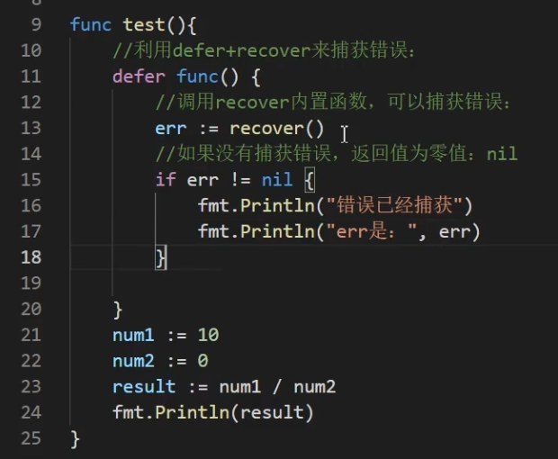

# 函数

> 对特定的功能进行提取，形成一个代码片段，这个代码片段就是我们所说的函数

## 作用

1. 提高代码的复用性
2. 函数和函数是并列关系，所以我们不能在函数里面定义函数
3. go 函数中不支持重载 即函数名相同 形参不同
4. go 函数中支持可变参数
   ```go
   func f1(args ...int) {
   	fmt.Println(args[0])
   }
   ```
5. 基本数据类型和数组默认值都是值传递的，即进行值拷贝，在函数内修改，不会影响到原来的值
6. 以值传递方式，如果希望达到引用传递的效果，可以传入变量的地址&，函数内以指针的方式操作变量
7. 函数也是一种数据类型，可以赋值给一个变量
8. 可以给类型和起别名 数据类型或者函数类型
9. 支持对函数返回值命名

## code

```go
/* 函数 */
func cal(n1 int, n2 int) (int, string) {
	return n1 + n2, "msg"
}
func f1(args ...int) {
	fmt.Println(args[0])
}
func f2(n int) {
	fmt.Println("f2")
}
func f3(n int, f func(int)) {
	f(2)
	fmt.Println(n)
	fmt.Printf("%T \n", f)

	// 自定义数据类型 相当于给类型起别名 虽然是别名 但是此时已经不和int相等了 但是可以转成int
	type myInt int
	var a myInt = 1
	fmt.Println(a)
}
```

## 匿名函数

> 可以在函数内部定义和使用 也可以把匿名函数赋值给一个全局变量
> 匿名函数定义时可以直接调用 跟 js 的立即执行函数类似

```go
func main() {
	// zhiZhen()
	// liuCheng()
	fmt.Println(cal(1, 2))
	f1(1)
	f3(1, f2)

	// 匿名函数
	f := func(a int) int {
		return a
	}
	f(1)
}
```

## 日期和时间

```go
	// 日期和时间
	now := time.Now()
	y := now.Year()
	fmt.Printf("%v ---- type: %T", now, now)

	// 固定用法 获取当前时间
	dateStr2 := now.Format("2006/01/02 15:04:05")
```

## 内置函数

1. 在 builtin 下

```go
	// new分配内存，new函数的实参是一个类型而不是具体数值，new函数返回值是对应类型的指针，num: *int
	num := new(int)
	println(num)
```

## 错误处理机制

1.  defer+recover 机制处理错误
    

```go
func test() {
	defer func() {
		err := recover()
		if err != nil {
			// 报错
			println(err)
		}
	}()
}

// 抛出自定义错误
// errors.New("eMsg")
```
