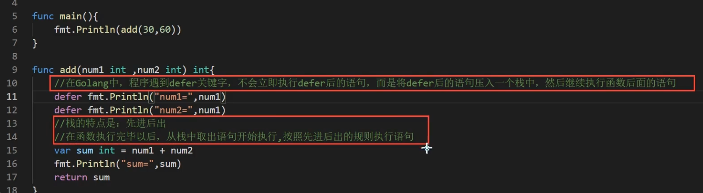

# 包

## 闭包

> 闭包就是一个函数和与其相关的引用环境组合的一个整体
> 本质：依旧是一个匿名函数，只是这个函数引入外界的变量/参数
> 特点：返回的是一个匿名函数，但是这个匿名函数引用到函数外的变量/参数，因此这个匿名函数就和变量/参数形成一个整体，构成闭包
> 特点：闭包中使用的变量/参数会一直保存在内存中，所以会一直使用，意味着闭包不可滥用

## defer 关键字的作用

在函数中，经常需要创建资源，为了在函数执行完毕后，及时的释放资源，Go 的设计者提供 defer 关键字

